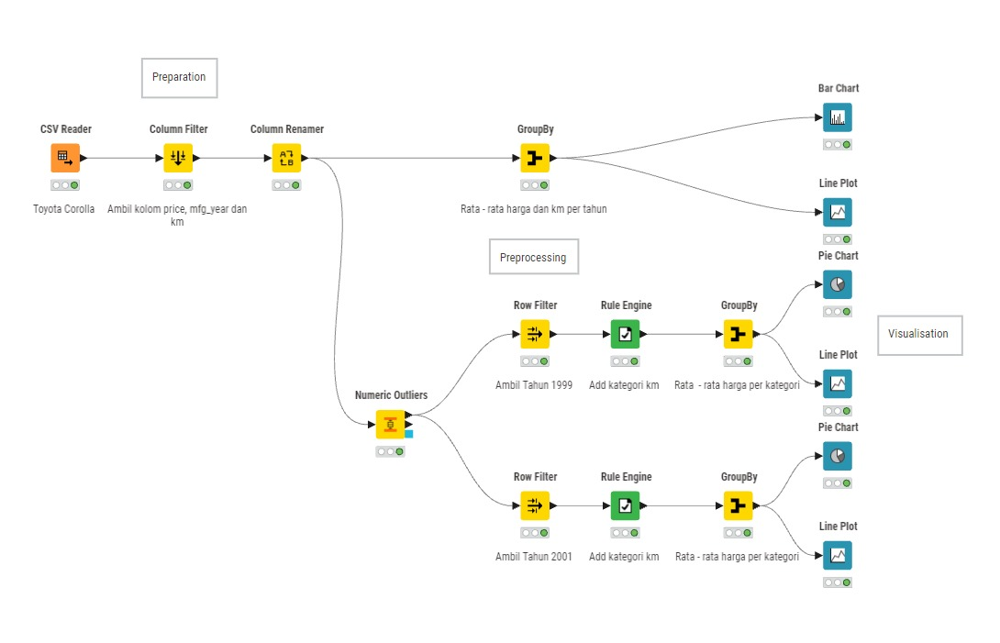
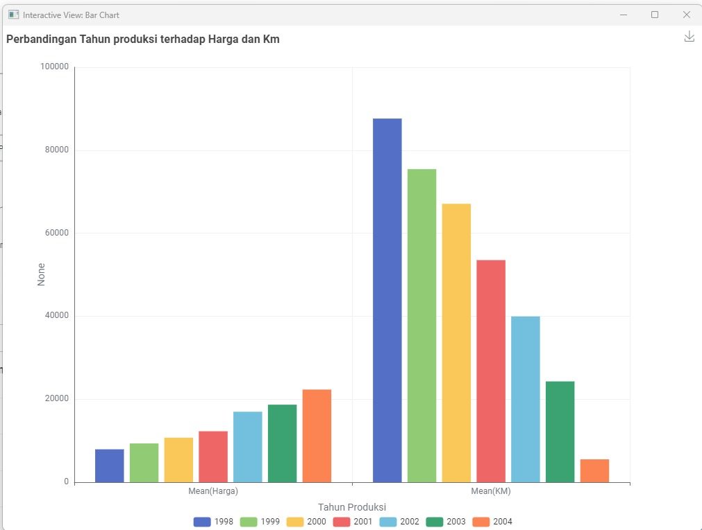
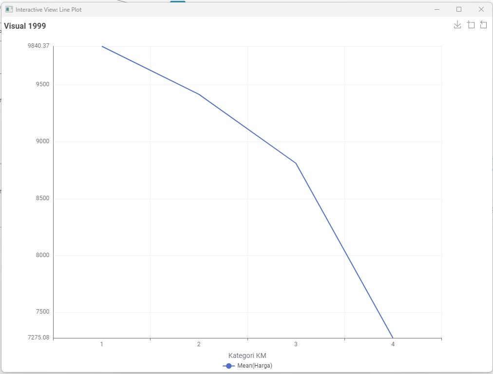
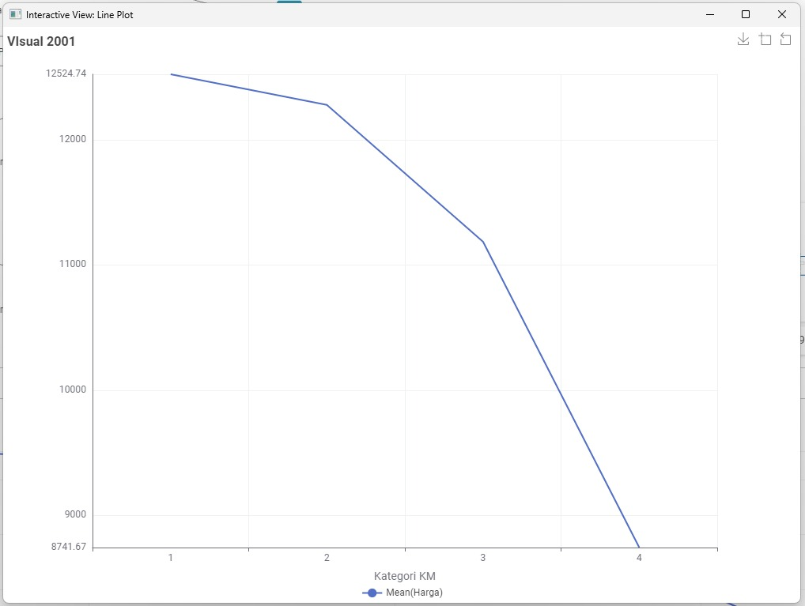

# Proyek Analisis Data Toyota Corolla (DAE)

**Oleh:** [Frederick Christian Osoen (C14220269) & Frederick Valentinus Setyawan (C14220209)]
**Dataset:** ToyotaCorolla.csv

Proyek ini bertujuan untuk melakukan Analisis Data Eksploratif (EDA) mendalam, Preprocessing, Agregasi, dan Visualisasi data pada dataset Toyota Corolla menggunakan platform KNIME. Fokus utama adalah mengidentifikasi tren harga dan dampak variabel kategoris.

---

## Alur Kerja KNIME (`Projek_UAS_Toyota.knwf`)

Alur kerja (Workflow) KNIME ini dibagi menjadi tiga tahap utama: Preprocessing, Feature Engineering & Agregasi, dan Visualisasi.

### Diagram Alur Kerja Keseluruhan
Berikut adalah visualisasi rinci dari *workflow* KNIME yang digunakan, yang mencakup tahap persiapan, pra-pemrosesan, dan visualisasi:

### 1. Preprocessing Data

| Node | Deskripsi |
| :--- | :--- |
| **CSV Reader** | Memuat data mentah dari file `ToyotaCorolla.csv`. |
| **Column Filter** | Memilih kolom-kolom yang relevan untuk analisis. |
| **Row Filter** | Menyaring baris data berdasarkan kriteria atau rentang nilai tertentu (misalnya, membatasi tahun produksi). |
| **String to Number / Number to String** | Memastikan tipe data variabel sudah sesuai untuk pemrosesan (misalnya, mengubah Harga menjadi tipe numerik). |

### 2. Feature Engineering & Agregasi

| Node | Deskripsi |
| :--- | :--- |
| **GroupBy (x Banyak Node)** | Melakukan agregasi kunci seperti menghitung **rata-rata Harga**, **rata-rata KM**, atau metrik lain berdasarkan variabel pengelompokan (misalnya, `Mfg_Year`, `Fuel_Type`). |
| **Rule Engine (x Banyak Node)** | Membuat kolom kategori baru (misalnya, **Label Harga: "Murah", "Sedang", "Mahal"**) berdasarkan aturan logika/threshold pada kolom kontinu (seperti Harga atau KM). |
| **Column Renamer** | Mengubah nama kolom hasil agregasi agar lebih mudah diidentifikasi (misalnya, `Average(Price)` menjadi `Average_Price`). |

### 3. Visualisasi Data

Node-node visualisasi digunakan untuk eksplorasi data (EDA) yang mendalam:

* **Line Plot:** Digunakan untuk memvisualisasikan **tren** dan **pola harga rata-rata** mobil seiring perubahan **Tahun Produksi**.
* **Bar Chart:** Digunakan untuk **membandingkan** nilai agregat (misalnya, rata-rata harga) antar kategori diskrit (misalnya, Tipe Bahan Bakar).
* **Pie Chart:** Menampilkan **proporsi persentase** pembagian kategori yang telah dibuat oleh **Rule Engine** (misalnya, persentase mobil yang termasuk kategori "Mahal").

---

##  Hasil Utama & Interpretasi Data

### Perbandingan Rata-rata Harga dan KM Berdasarkan Tahun Produksi

Visualisasi ini membandingkan rata-rata harga (Mean(Harga)) dan rata-rata jarak tempuh (Mean(KM)) dari mobil Toyota Corolla untuk setiap tahun produksi dari 1999 hingga 2001.

### Tren Harga Rata-rata Berdasarkan Kategori KM

#### Visual Tahun 1999
Line Plot menunjukkan hubungan antara rata-rata harga dan empat kategori KM (1-4). Terlihat penurunan tajam harga rata-rata seiring dengan kenaikan Kategori KM.

#### Visual Tahun 2001
Tren serupa juga teramati pada mobil produksi tahun 2001, di mana harga rata-rata menurun signifikan seiring peningkatan Kategori KM dari 1 ke 4.

### INSIGHT (Temuan Kunci dari Data)

* **Tren Harga terhadap Usia:** Terdapat **hubungan terbalik yang kuat** antara rata-rata harga mobil dan usia mobil (atau hubungan positif dengan Tahun Produksi), yang merupakan faktor penentu nilai utama.
* **Dampak Kategoris:** Visualisasi menunjukkan bagaimana variabel kategoris seperti **Tipe Bahan Bakar** atau **Jumlah Pintu** memengaruhi rata-rata harga jual.
* **Distribusi Harga:** Sebagian besar data terdistribusi pada kategori harga tertentu (misalnya, dominasi kategori "Sedang" atau "Murah"), sebagaimana terlihat pada **Pie Chart**.

### INTERPRETASI (Makna Analisis)

* **EDA yang Sukses:** *Workflow* berhasil melakukan Eksplorasi Data yang mendalam, mengubah data mentah menjadi *insight* yang visual dan mudah dipahami, menjadikannya basis kuat untuk analisis lebih lanjut.
* **Feature Engineering:** Proses Agregasi dan Kategorisasi (Rule Engine) telah berhasil menciptakan fitur-fitur baru yang lebih informatif dan menyederhanakan target (harga kontinu menjadi label diskrit) untuk keperluan analisis dan potensi pemodelan sederhana.
* **Kesimpulan Umum:** Tahun produksi merupakan prediktor harga yang paling dominan, namun harga mobil tetap dipengaruhi oleh kombinasi faktor-faktor lain (seperti KM dan spesifikasi).
