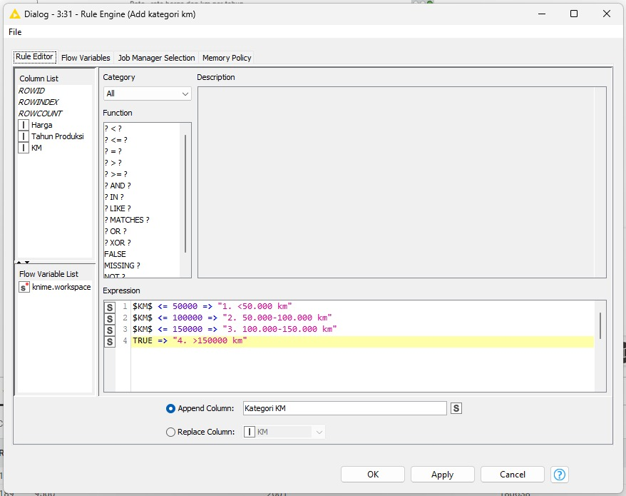
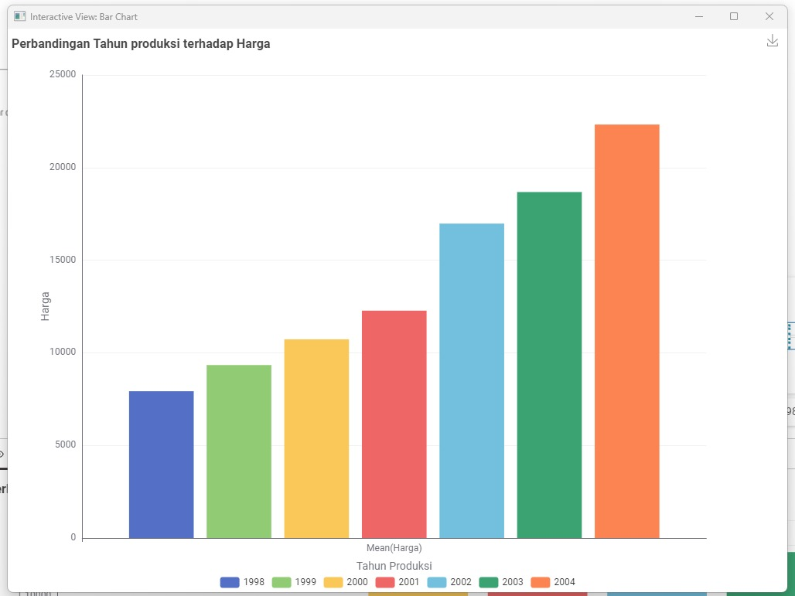
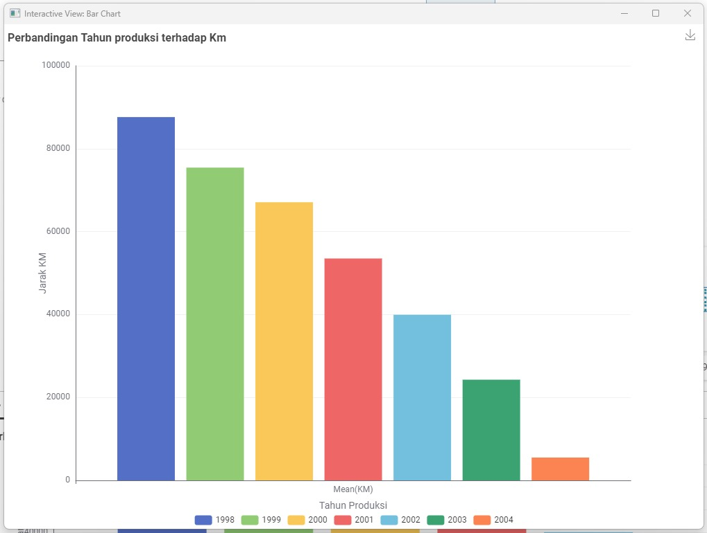
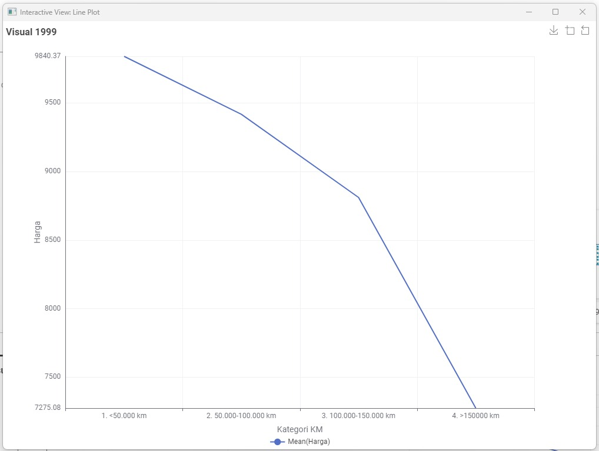
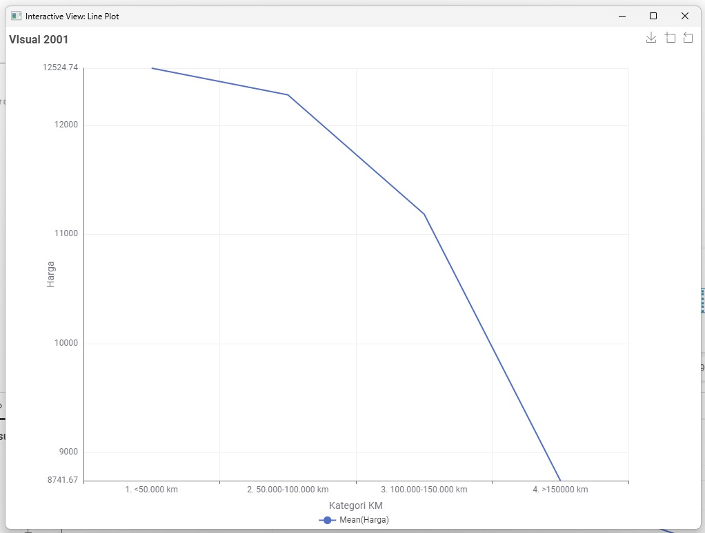

# 🚗 Proyek Analisis Data Toyota Corolla (DAE)

**Oleh:** [Frederick Christian Osoen (C14220269) & Frederick Valentinus Setyawan (C14220209)]
**Dataset:** ToyotaCorolla.csv

Proyek ini bertujuan untuk melakukan Analisis Data Eksploratif (EDA) mendalam, Preprocessing, Agregasi, dan Visualisasi data pada dataset Toyota Corolla menggunakan platform KNIME. Fokus utama adalah mengidentifikasi **tren harga** dan **dampak variabel kategoris** terhadap nilai mobil.

---

## 🛠️ Alur Kerja KNIME (`Projek_UAS_Toyota.knwf`)

Alur kerja (Workflow) KNIME ini dibagi menjadi tiga tahap utama: Preprocessing, Feature Engineering & Agregasi, dan Visualisasi.

### Diagram Aturan Kategori KM
Berikut adalah pengaturan Rule Engine yang digunakan untuk membuat kolom kategori KM baru:

### 1. Preprocessing Data

| Node | Deskripsi |
| :--- | :--- |
| **CSV Reader** | Memuat data mentah dari file `ToyotaCorolla.csv`. |
| **Column Filter** | Memilih kolom-kolom yang relevan (misalnya, `price`, `mfg_year`, `km`) untuk analisis. |
| **Row Filter** | Menyaring baris data berdasarkan kriteria atau rentang nilai tertentu (misalnya, membatasi tahun produksi). |
| **String to Number / Number to String** | Memastikan tipe data variabel sudah sesuai untuk pemrosesan (misalnya, mengubah Harga menjadi tipe numerik). |

### 2. Feature Engineering & Agregasi

| Node | Deskripsi |
| :--- | :--- |
| **GroupBy (x Banyak Node)** | Melakukan agregasi kunci seperti menghitung **rata-rata Harga**, **rata-rata KM**, atau metrik lain berdasarkan variabel pengelompokan (misalnya, `Mfg_Year`, `Fuel_Type`). |
| **Rule Engine (x Banyak Node)** | Membuat kolom kategori baru (misalnya, **Label Harga** atau **Kategori KM**) berdasarkan aturan logika/threshold pada kolom kontinu. Kategori KM dikelompokkan menjadi: **1. < 50.000 km**, **2. 50.000-100.000 km**, **3. 100.000-150.000 km**, dan **4. >150.000 km**. |
| **Column Renamer** | Mengubah nama kolom hasil agregasi agar lebih mudah diidentifikasi. |

### 3. Visualisasi Data

Node-node visualisasi digunakan untuk eksplorasi data (EDA) yang mendalam:

* **Line Plot:** Digunakan untuk memvisualisasikan **tren** dan **pola harga rata-rata** mobil.
* **Bar Chart:** Digunakan untuk **membandingkan** nilai agregat (misalnya, rata-rata harga) antar kategori diskrit.
* **Pie Chart:** Menampilkan **proporsi persentase** pembagian kategori.

---

## 📈 Hasil Utama & Interpretasi Data

### 1. Perbandingan Rata-rata Harga Berdasarkan Tahun Produksi

Visualisasi ini menunjukkan tren rata-rata harga (Mean(Harga)) dari tahun 1998 hingga 2004. Terlihat jelas bahwa **rata-rata harga mobil meningkat secara signifikan dan konsisten** seiring dengan tahun produksi yang lebih baru, menegaskan hubungan kuat antara usia mobil dan harganya.

### 2. Perbandingan Rata-rata Jarak Tempuh (KM) Berdasarkan Tahun Produksi

Bar Chart ini menunjukkan rata-rata jarak tempuh (Mean(KM)) dari mobil per tahun produksi. Dapat dilihat bahwa **mobil dengan tahun produksi yang lebih tua (terutama 1998)** memiliki rata-rata KM yang jauh lebih tinggi, dan **rata-rata KM menurun drastis** pada mobil yang lebih baru. Hal ini menunjukkan bahwa mobil baru cenderung memiliki jarak tempuh yang lebih rendah.

### 3. Tren Harga Rata-rata Berdasarkan Kategori KM

#### Visual Tahun 1999
Line Plot ini memvisualisasikan hubungan antara rata-rata harga dan empat Kategori KM untuk mobil yang diproduksi tahun 1999. Terdapat **penurunan harga yang sangat curam** dari kategori KM terendah (1. < 50.000 km) ke kategori KM tertinggi (4. >150.000 km), menegaskan bahwa **jarak tempuh adalah faktor depresiasi nilai utama**.

#### Visual Tahun 2001
Tren serupa juga teramati pada mobil produksi tahun 2001. Penurunan harga rata-rata sangat signifikan seiring peningkatan Kategori KM. Meskipun harga dasarnya lebih tinggi daripada tahun 1999, tren penurunan ini konsisten, menggarisbawahi **dampak ganda: harga dipengaruhi oleh Tahun Produksi (usia) dan KM (kondisi)**.

### INSIGHT (Temuan Kunci dari Data)

* **Tren Harga terhadap Usia:** Terdapat **hubungan terbalik yang kuat** antara rata-rata harga mobil dan usia mobil (hubungan positif dengan Tahun Produksi).
* **Dampak Jarak Tempuh (KM):** Jarak tempuh tinggi berkorelasi kuat dengan tahun produksi yang lebih tua dan harga jual yang lebih rendah, menjadikannya **prediktor harga yang sangat dominan**.
* **Distribusi Harga:** Sebagian besar data terdistribusi pada kategori harga tertentu (misalnya, dominasi kategori "Sedang" atau "Murah"), sebagaimana terlihat pada **Pie Chart**.

### INTERPRETASI (Makna Analisis)

* **EDA yang Sukses:** *Workflow* berhasil melakukan Eksplorasi Data yang mendalam, mengubah data mentah menjadi *insight* yang visual dan mudah dipahami, menjadikannya basis kuat untuk analisis lebih lanjut.
* **Feature Engineering:** Proses Agregasi dan Kategorisasi (Rule Engine) telah berhasil menciptakan fitur-fitur baru yang lebih informatif (seperti Kategori KM) dan menyederhanakan target untuk keperluan analisis.
* **Kesimpulan Umum:** **Tahun produksi dan Jarak Tempuh (KM) merupakan prediktor harga yang paling dominan** untuk Toyota Corolla, dan keduanya memiliki hubungan terbalik yang jelas dengan nilai jual mobil.
